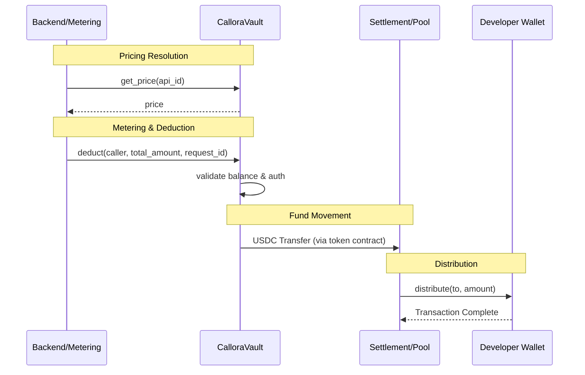

# Callora Contracts

Soroban smart contracts for the Callora API marketplace: prepaid vault (USDC) and balance deduction for pay-per-call settlement.

[](https://github.com/CalloraOrg/Callora-Contracts/actions/workflows/ci.yml)
[](https://github.com/CalloraOrg/Callora-Contracts/actions/workflows/coverage.yml)

## Tech stack

- **Rust** with **Soroban SDK** (Stellar)
- Contract compiles to WebAssembly and deploys to Stellar/Soroban
- Minimal WASM size (~17.5 KB for vault)

## What's included

### 1. `callora-vault`

The primary storage and metering contract. Holds USDC on behalf of API consumers and deducts balances on every metered call.

**Initialization**
- `init(owner, usdc_token, initial_balance, authorized_caller, min_deposit, revenue_pool, max_deduct)` — One-time setup; validates all parameters and verifies on-ledger USDC balance.

**Deposits & withdrawals**
- `deposit(caller, amount)` — Owner or allowed depositor transfers USDC into the vault.
- `withdraw(amount)` — Owner withdraws USDC to their own address.
- `withdraw_to(to, amount)` — Owner withdraws USDC to an arbitrary address.

**Deductions**
- `deduct(caller, amount, request_id)` — Decrease balance for one API call; routes funds to settlement or revenue pool.
- `batch_deduct(caller, items)` — Atomically process up to 50 deductions; all-or-nothing.

**Pricing**
- `set_price(caller, api_id, price)` — Owner-only; configure the per-call price for `api_id`.
- `get_price(api_id)` — Returns `Option<i128>` with the configured price.

**Metadata**
- `set_metadata(caller, offering_id, metadata)` — Owner-only; attach off-chain data (IPFS/URI) to an offering.
- `update_metadata(caller, offering_id, metadata)` — Owner-only; replace existing metadata.
- `get_metadata(offering_id)` — Returns `Option<String>` for the stored value.

**Balance & configuration views**
- `balance()` — Current tracked USDC balance.
- `get_meta()` — Full `VaultMeta` struct (owner, balance, authorized caller, min deposit).
- `get_max_deduct()` — Per-call deduction cap.

**Routing configuration** *(admin-only)*
- `set_settlement(caller, settlement_address)` / `get_settlement()` — Settlement contract address.
- `set_revenue_pool(caller, revenue_pool)` / `get_revenue_pool()` — Revenue pool address.

**Access control**
- `set_admin(caller, new_admin)` / `accept_admin()` / `get_admin()` — Two-step admin transfer.
- `transfer_ownership(new_owner)` / `accept_ownership()` — Two-step owner transfer.
- `set_allowed_depositor(caller, depositor)` / `clear_allowed_depositors(caller)` / `get_allowed_depositors()` — Deposit allowlist.
- `set_authorized_caller(caller)` — Owner-only; set who may call `deduct`.
- `is_authorized_depositor(caller)` — Returns `bool`.

**Circuit breaker**
- `pause(caller)` / `unpause(caller)` / `is_paused()` — Admin or owner; blocks deposits and deductions.
- `distribute(caller, to, amount)` — Admin-only; direct USDC transfer from vault.

---

### 2. `callora-revenue-pool`

Simple distribution contract. Accumulates USDC from vault deductions and lets an admin send it to developers.

- `init(admin, usdc_token)` — One-time setup; validates neither address is the contract itself.
- `distribute(caller, to, amount)` — Admin sends USDC to a single recipient.
- `batch_distribute(caller, payments)` — Atomically distribute to multiple recipients; pre-validates total balance.
- `balance()` — Contract's current USDC balance.
- `receive_payment(caller, amount, from_vault)` — Emits an indexer event; does not move tokens.
- `get_admin()` / `set_admin(caller, new_admin)` / `claim_admin()` — Two-step admin transfer.

---

### 3. `callora-settlement`

Advanced settlement with per-developer balance tracking. Receives USDC from the vault and credits either a global pool or individual developers.

- `init(admin, vault_address)` — One-time setup; links to the vault.
- `receive_payment(caller, amount, to_pool, developer)` — Credits global pool or a specific developer.
- `get_developer_balance(developer)` — Tracked balance for one developer (`i128`).
- `get_all_developer_balances()` — Returns a `Map<Address, i128>` of all recorded balances.
- `get_global_pool()` — Returns `GlobalPool { total_balance, last_updated }`.
- `get_admin()` / `set_admin(caller, new_admin)` / `accept_admin()` — Two-step admin transfer.
- `get_vault()` / `set_vault(caller, new_vault)` — View or update the linked vault address (admin-only).

---

## Architecture & Flow

The following diagram illustrates the interaction between the backend, the user's vault, and the settlement contracts during an API call.



## Local setup

1. **Prerequisites:**
   - [Rust](https://rustup.rs/) (stable)
   - [Stellar Soroban CLI](https://developers.stellar.org/docs/smart-contracts/getting-started/setup) (`cargo install soroban-cli`)

2. **Build and test:**

   ```bash
   cargo fmt --all
   cargo clippy --all-targets --all-features -- -D warnings
   cargo build
   cargo test
   ```

3. **Build WASM:**

   ```bash
   # Build all publishable contract crates and verify their release WASM sizes
   ./scripts/check-wasm-size.sh

   # Or build a specific contract manually
   cargo build --target wasm32-unknown-unknown --release -p callora-vault
   ```

## Development

Use one branch per issue or feature. Run `cargo fmt --all`, `cargo clippy --all-targets --all-features -- -D warnings`, `cargo test`, and `./scripts/check-wasm-size.sh` before pushing so every publishable contract stays within Soroban's WASM size limit.

### Test coverage

The project enforces a **minimum of 95% line coverage** on every push via GitHub Actions (see [`.github/workflows/coverage.yml`](.github/workflows/coverage.yml)).

```bash
# Run coverage locally
./scripts/coverage.sh
```

## Project layout

```
callora-contracts/
├── .github/workflows/
│   ├── ci.yml              # CI: fmt, clippy, test, WASM build
│   └── coverage.yml        # CI: enforces 95% coverage on every push
├── contracts/
│   ├── vault/              # Primary storage and metering
│   ├── revenue_pool/       # Simple revenue distribution
│   └── settlement/         # Advanced balance tracking
├── scripts/
│   ├── coverage.sh         # Local coverage runner
│   └── check-wasm-size.sh  # WASM size verification
├── docs/
│   ├── interfaces/         # JSON contract interface summaries (vault, settlement, revenue_pool)
│   └── ACCESS_CONTROL.md   # Role-based access control overview
├── BENCHMARKS.md           # Gas/cost notes
├── EVENT_SCHEMA.md         # Event topics and payloads
├── UPGRADE.md              # Upgrade and migration path
├── SECURITY.md             # Security checklist
└── tarpaulin.toml          # cargo-tarpaulin configuration
```

## Contract interface summaries

Machine-readable JSON summaries of every public function and parameter for each contract are maintained under [`docs/interfaces/`](docs/interfaces/). They serve as the canonical reference for backend integrators using `@stellar/stellar-sdk`.

| File | Contract |
|------|----------|
| [`docs/interfaces/vault.json`](docs/interfaces/vault.json) | `callora-vault` |
| [`docs/interfaces/settlement.json`](docs/interfaces/settlement.json) | `callora-settlement` |
| [`docs/interfaces/revenue_pool.json`](docs/interfaces/revenue_pool.json) | `callora-revenue-pool` |

See [`docs/interfaces/README.md`](docs/interfaces/README.md) for the schema description and regeneration steps.

## Security Notes

- **Checked arithmetic**: All balance mutations use `checked_add` / `checked_sub` with explicit panics.
- **Input validation**: `amount > 0` enforced on all deposits and deductions.
- **Overflow checks**: Enabled in both dev and release profiles (`Cargo.toml`).
- **Role-Based Access**: Documented in [docs/ACCESS_CONTROL.md](docs/ACCESS_CONTROL.md).

See [SECURITY.md](SECURITY.md) for the full Vault Security Checklist and audit recommendations.

---

Part of [Callora](https://github.com/CalloraOrg).
